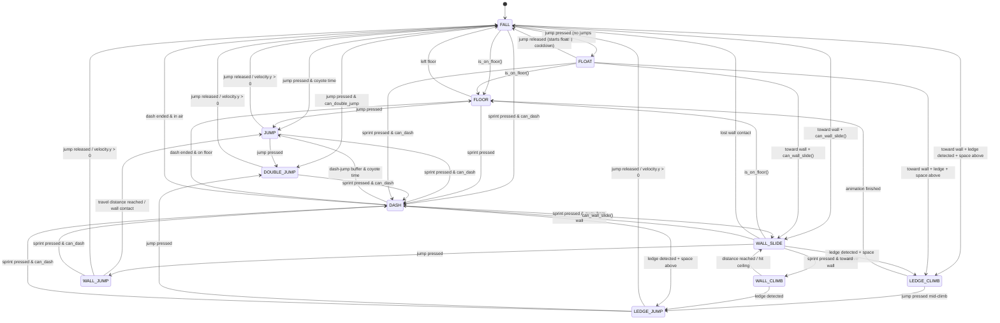

# Silksong Tutorial

A Godot 4.6 (C#) 2D platformer tutorial project inspired by Hollow Knight: Silksong, focused on implementing a fluid player controller with Silksong-style movement mechanics.

## Features

- State machine player controller with the following states:
  - Floor, Fall, Jump, Double Jump, Float, Ledge Climb, Ledge Jump, Wall Slide, Wall Jump, Wall Climb, Dash
- Coyote time
- Float mechanic with cooldown
- Ledge grab and climb with mid-climb jump
- Wall slide, wall jump, and wall climb
- Dash with cooldown and dash-jump buffer
- Pixel art sprite animations

## Controls

| Action | Key |
|--------|-----|
| Move Left | Left Arrow |
| Move Right | Right Arrow |
| Jump / Float | Space |
| Dash / Wall Climb | Shift |

## Requirements

- [Godot 4.6](https://godotengine.org/) with .NET support
- Jolt Physics (bundled with Godot 4.6)

## Getting Started

1. Clone the repo
2. Open `project.godot` in Godot 4.6
3. Run the `pixel_level` scene

## State Machine



## Project Structure

```
assets/
  art/2d/          # Sprite sheets
  prefabs/player/  # Player scene
  scenes/levels/   # Level scenes
  scripts/player/  # Player controller GDScript
  resources/       # Tilesets and other resources
```
